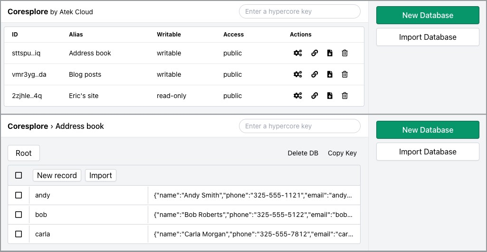

# Coresplore

⚠️ Alpha Software ⚠️

An easy-to-run Web app for exploring and editing Hypercores.

```bash
npm i -g coresplore
```

## Features

- [ ] Access Hypercores
  - [x] Hyperbees using utf8 keys and JSON values
  - [ ] Hyperbees with other key or value encodings
  - [ ] Hypercores with no known "data structure"
  - [ ] Multiwriter hypercores
- [x] Create and/or save Hypercores
- [x] Edit, copy, rename, and delete records
- [x] Import and export databases as JSON captures
- [ ] View Hyperbee record history
- [ ] Various other TODOs
  - [ ] Clear data from deleted DBs



## Usage

```bash
$ coresplore
```

This will start the coresplore web app at `localhost:2000`. Your data will be stored in `~/.coresplore`. You can change the port with `-p/--port` and the storage dir with `--storage`.

You can set a password on the Web app with the `--password` flag. The username will be "admin."

## License

MIT licensed. Copyright Blue Link Labs 2021.